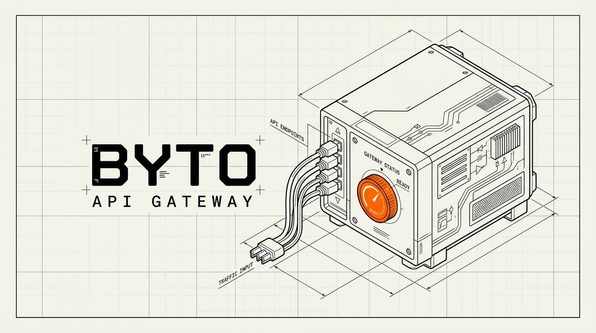

<p align="center">
  
</p>

# Byto

<p align="center">
  <a href="https://golang.org"></a>
  <a href="LICENSE"></a>
  <a href="https://www.docker.com"></a>
  <a href="https://cloud.google.com/vertex-ai"></a>
</p>

Byto is a Go gateway that turns your own Vertex AI Gemini access into an OpenAI-compatible API.

```text
your apps -> Byto -> Vertex AI Gemini
```

It is built for explicit model selection, service API keys, production service-account auth, priority PayGo headers, reasoning controls, JSONL logs, and Docker/server deployments.

---

## Quick Start

Interactive local setup:

```bash
make setup
```

Production service-account setup:

```bash
make setup production
```

Run the gateway:

```bash
make run
```

Call it:

```bash
curl -s http://localhost:8080/v1/chat/completions \
  -H "Authorization: Bearer <gateway-api-key>" \
  -H "Content-Type: application/json" \
  -d '{
    "model": "gemini-2.5-flash",
    "messages": [{ "role": "user", "content": "Reply with only: ok" }]
  }' | jq
```

Docker:

```bash
docker compose up --build
```

---

## What You Get

- `POST /v1/chat/completions`
- `GET /v1/models`
- `GET /healthz`
- OpenAI-style `model`, `messages`, `stream`, `service_tier`, and `reasoning_effort`
- Vertex cache endpoints under `/v1/caches`
- API-key gateway auth
- Durable service-account auth for production
- Startup model-catalog refresh from Vertex
- JSONL access/request logs with token usage, traffic type, reasoning tokens, and upstream status

Full API docs: [docs/API.md](docs/API.md)

Detailed setup docs: [docs/SETUP_DETAIL.md](docs/SETUP_DETAIL.md)

---

## Model Rules

There is no default model. If `model` is missing or empty, Byto returns `400`.

Allowed models come from [config/models.json](config/models.json), aliases, or `ALLOW_ANY_GEMINI_MODEL=true`.

---

## Tests

```bash
make test
```

Live Vertex checks require real Google auth:

```bash
make test-live MODEL=gemini-2.5-flash
```

CI also runs a fake-cloud production setup e2e on Linux and Windows so the `make setup production` path stays portable.

---

## License

MIT. See [LICENSE](LICENSE).
