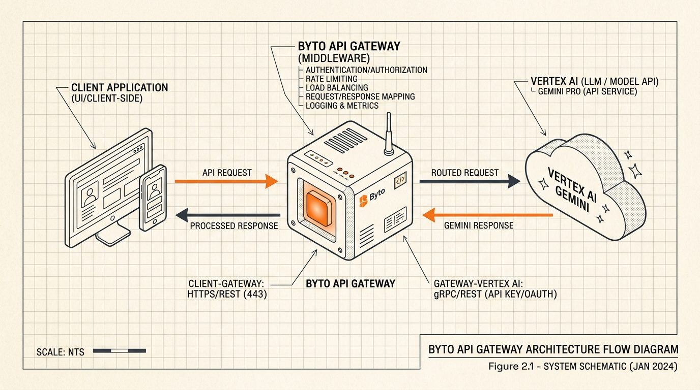
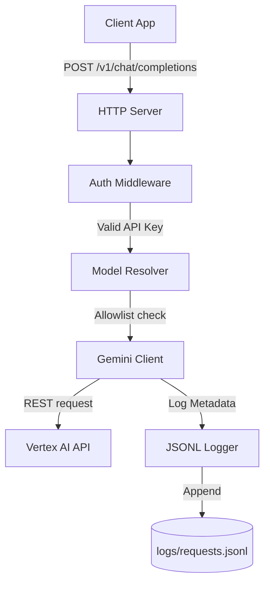

<p align="center">
  
</p>

# Byto

<p align="center">
  <a href="https://golang.org"></a>
  <a href="LICENSE"></a>
  <a href="https://www.docker.com"></a>
  <a href="https://cloud.google.com/vertex-ai"></a>
</p>

Byto is a Go gateway that exposes an OpenAI-compatible API for Vertex AI Gemini. It gives your apps one internal LLM endpoint while keeping model selection explicit.

```text
your apps -> Byto -> Vertex AI Gemini
```

---

## What It Does

- Serves `POST /v1/chat/completions`
- Serves `GET /v1/models`
- Serves `GET /healthz`
- Requires service API keys with `Authorization: Bearer ...`
- Requires callers to send a model on every completion request
- Translates OpenAI-style chat payloads to Vertex Gemini `generateContent`
- Supports streaming responses with server-sent events
- Writes JSONL request logs
- Refreshes the local Gemini model catalog from Vertex on startup

Full endpoint documentation lives in [docs/API.md](docs/API.md).

---

## Real-Time Flow

Here is how requests travel through the gateway to Vertex AI Gemini:

<p align="center">
  
</p>

---

## Architecture

This diagram shows how requests are handled inside the gateway:



---

## Requirements

- Go 1.22+
- Google Cloud CLI
- Docker, for cloud setup and container builds
- A Google Cloud project that can call Vertex AI

---

## Local Setup

Use one command to run the interactive setup flow:

```bash
make setup PROJECT=your-project-id
```

The setup flow checks dependencies, writes `.env`, guides Google auth, sets the Application Default Credentials (ADC) quota project, enables Vertex AI, runs local verification, and then shows an interactive action menu.

During setup, choose one gateway access mode:

- `Protect with API key`: setup generates an API key, writes it to `.env`, and copies it to your clipboard.
- `Open access`: `/v1/*` endpoints accept requests without `Authorization`. Use this only behind private networking, Cloud Run IAM, or another trusted gateway.

For scripted open mode:

```bash
make setup PROJECT=your-project-id OPEN=1 NON_INTERACTIVE=1
```

To switch back to API-key mode:

```bash
make setup PROJECT=your-project-id PROTECTED=1 NON_INTERACTIVE=1
```

Run the gateway:

```bash
make run
```

Call the gateway:

```bash
curl -s http://localhost:8080/v1/chat/completions \
  -H "Authorization: Bearer <gateway-api-key>" \
  -H "Content-Type: application/json" \
  -d '{
    "model": "gemini-2.5-flash",
    "messages": [{ "role": "user", "content": "Reply with only: ok" }]
  }' | jq
```

---

## Cloud Setup

Use the production path when you want a durable service-account setup for container/server runs:

```bash
make setup production PROJECT=your-project-id MODEL=gemini-2.5-flash
```

Production setup creates or reuses a Google service account, grants Vertex access, creates an ignored key under `secrets/`, writes `.env`, copies the gateway API key to your clipboard, and verifies the gateway through the Go server.

Switch Vertex auth mode any time:

```bash
make switch AUTH=service MODEL=gemini-2.5-flash
make switch AUTH=token MODEL=gemini-2.5-flash
```

`AUTH=service` clears `VERTEX_ACCESS_TOKEN` and uses `GOOGLE_APPLICATION_CREDENTIALS`. This is the durable Docker/server mode.

`AUTH=token` writes a fresh `VERTEX_ACCESS_TOKEN` from `gcloud auth application-default print-access-token` and clears `GOOGLE_APPLICATION_CREDENTIALS`. This is useful for short local checks because Google access tokens expire.

Docker Compose works with either active mode from `.env`:

```bash
docker compose up --build
```

Use the cloud path when you want Cloud Run readiness:

```bash
make setup-cloud PROJECT=your-project-id MODEL=gemini-2.5-flash
```

Equivalent alias:

```bash
make setup cloud PROJECT=your-project-id MODEL=gemini-2.5-flash
```

Cloud setup checks Google auth, checks Docker, writes `.env`, enables the required Google Cloud APIs, creates the Cloud Run service account, grants IAM roles, builds the Docker image, and runs live Vertex end-to-end verification.

Deploy during setup:

```bash
make setup-cloud PROJECT=your-project-id MODEL=gemini-2.5-flash DEPLOY=1
```

---

## Configuration

The runtime reads `.env` automatically through the Makefile. Here is the configuration format:

```bash
GOOGLE_CLOUD_PROJECT=your-project-id
GOOGLE_CLOUD_LOCATION=global
GATEWAY_API_KEYS=comma,separated,service,keys
GATEWAY_ALLOW_UNAUTHENTICATED=false
MODEL_CATALOG_PATH=config/models.json
MODEL_CATALOG_REFRESH_ON_START=true
ALLOW_ANY_GEMINI_MODEL=false
VERTEX_BASE_URL=https://aiplatform.googleapis.com
GOOGLE_APPLICATION_CREDENTIALS=secrets/llm-gateway-sa.json
VERTEX_ACCESS_TOKEN=
PORT=8080
LOG_PATH=logs/requests.jsonl
REQUEST_TIMEOUT_SECONDS=180
VERTEX_RETRY_MAX_ATTEMPTS=3
VERTEX_RETRY_INITIAL_MS=250
VERTEX_RETRY_MAX_MS=2000
```

---

## Models

There is no default model. If `model` is missing or empty, Byto returns `400`.

Byto resolves models in this order:

1. Reject empty `model`.
2. Apply `MODEL_ALIASES`, if configured.
3. Accept enabled and available models from `config/models.json`.
4. If `ALLOW_ANY_GEMINI_MODEL=true`, accept any resolved model that starts with `gemini-`.
5. Reject everything else.

`config/models.json` stores model metadata such as enabled state, live availability, supported actions, and reasoning-effort tiers. Startup refresh adds newly discovered Vertex Gemini models as disabled entries for review.

---

## Logs

Default request log path:

```text
logs/requests.jsonl
```

Each JSONL record includes request ID, optional `X-App-ID`, requested model, resolved Vertex model, stream flag, HTTP status, latency, token counts, and error text when present.

---

## Open Source Readiness

Byto is fully prepared to be open sourced:

- **MIT License**: Included in the [LICENSE](LICENSE) file, permitting private and commercial usage.
- **CI/CD Pipeline**: A pre-configured GitHub Actions test workflow runs on every push and pull request.
- **Environment Isolation**: Example configurations (`.env.example` and `config.example.json`) ensure zero credential leaks.
- **Testing**: Includes a comprehensive test suite (unit tests and live Vertex integration tests). Run tests locally using `make test`.
